# MapConductor Android SDK Architecture

## Overview

MapConductor is a **unified mapping library** for Android that provides a single, consistent API for integrating multiple map providers. It enables developers to write mapping code once and deploy across different backends (Google Maps, Mapbox, HERE, ArcGIS) without provider-specific implementation details.

**Key Characteristics:**
- **Language**: Kotlin 2.2.21
- **UI Framework**: Jetpack Compose 1.8.1
- **Pattern**: Layered Multi-Provider Architecture
- **State Management**: Kotlin StateFlow (Reactive)
- **Supported Providers**: Google Maps, Mapbox, HERE Maps, ArcGIS, MapLibre
- **Android SDK**: 26-35 (minSdk=26, targetSdk=35)

---

## High-Level Architecture

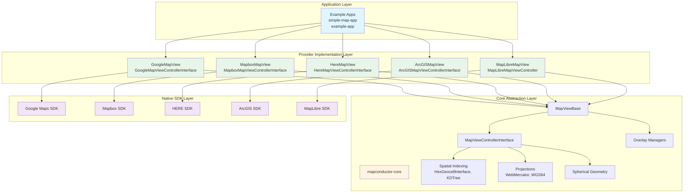

---

## Module Structure

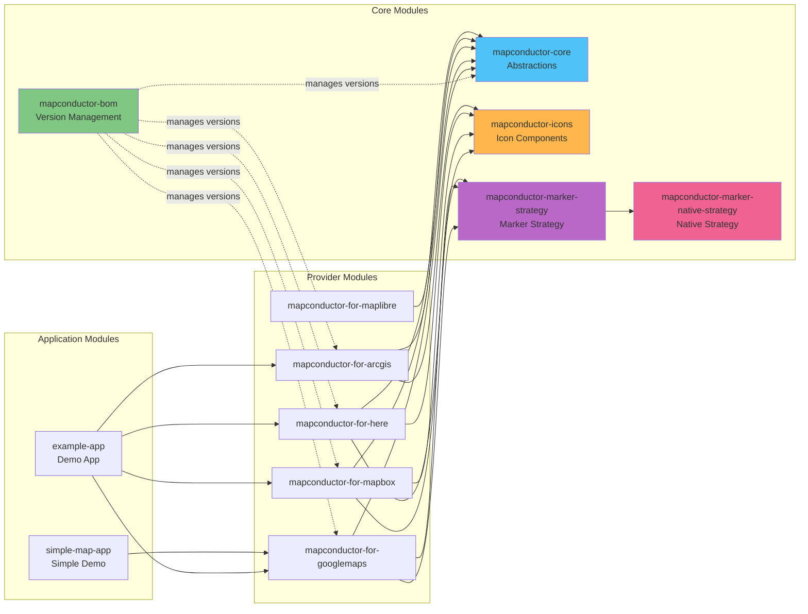

---

## Core Component Architecture

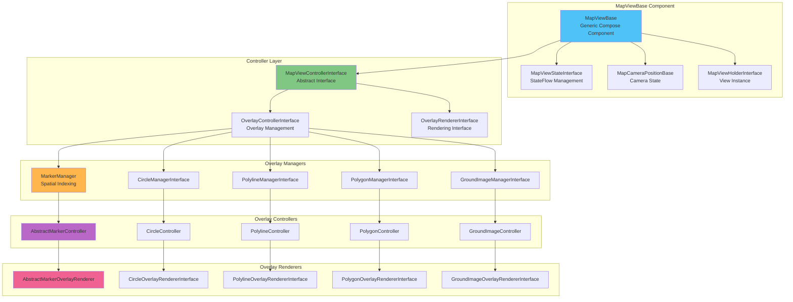

---

## Provider Implementation Pattern

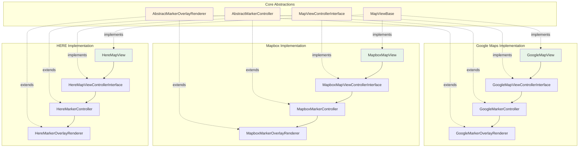

---

## Overlay Management System

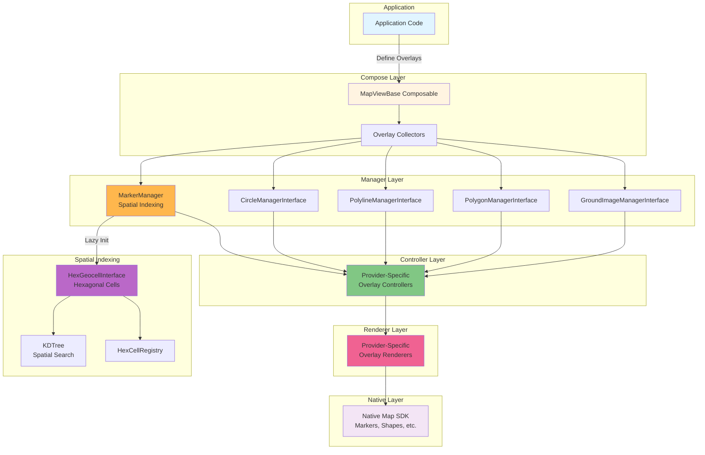

---

## Spatial Indexing for Markers

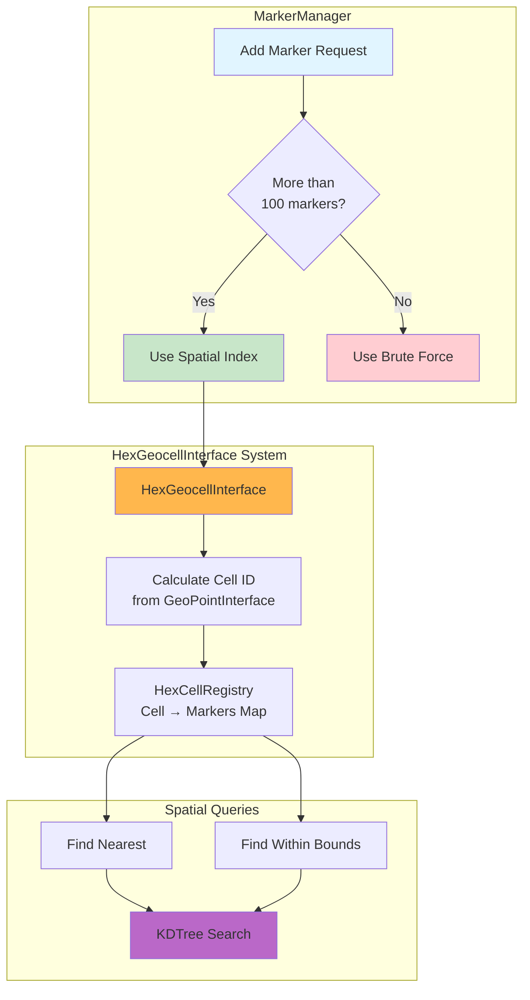

---

## Reactive State Management

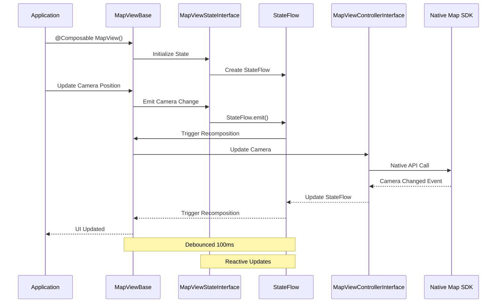

---

## ProjectionInterface & Coordinate Systems

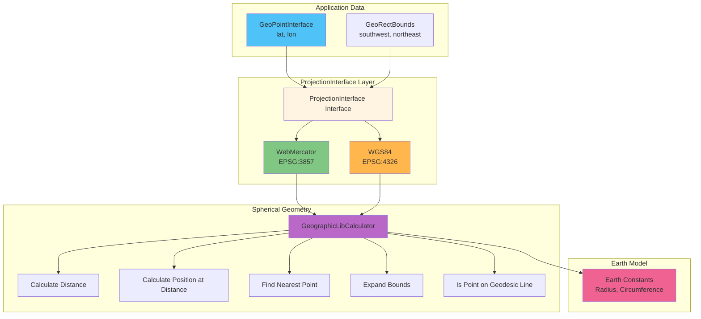

---

## Marker Rendering Strategy

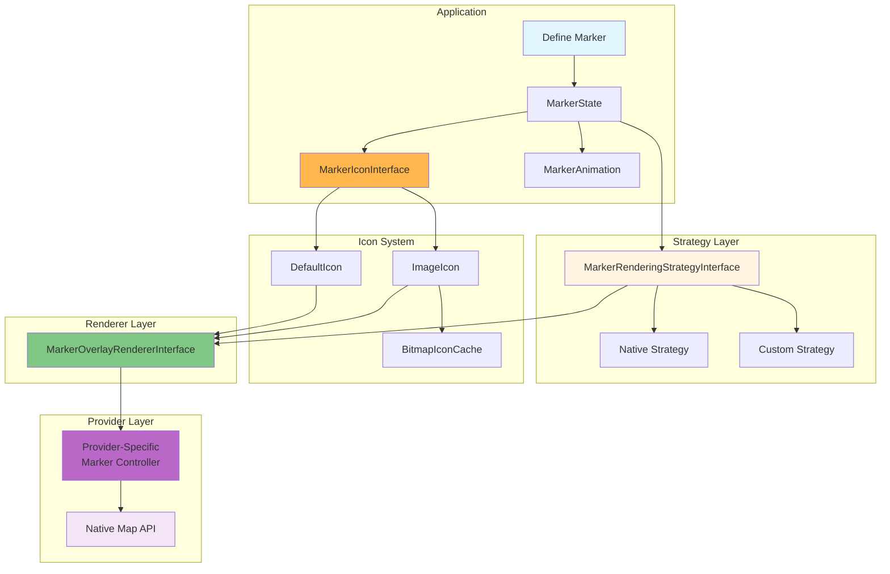

---

## Directory Structure

```
android-sdk/
├── mapconductor-core/                     # Core abstractions (335 files)
│   └── src/main/java/com/mapconductor/core/
│       ├── controller/                    # Controllers & interfaces
│       │   ├── MapViewControllerInterface.kt       # Abstract map controller
│       │   ├── BaseMapViewController.kt   # Base implementation
│       │   ├── OverlayControllerInterface.kt       # Overlay management
│       │   └── OverlayRendererInterface.kt         # Rendering interface
│       ├── map/                           # Map components
│       │   ├── MapViewBase.kt             # Generic Compose component
│       │   ├── MapViewStateInterface.kt            # State management
│       │   ├── MapCameraPositionBase.kt   # Camera abstraction
│       │   └── MapViewHolderInterface.kt           # View holder
│       ├── marker/                        # Marker system
│       │   ├── Marker.kt                  # MarkerState definition
│       │   ├── MarkerManager.kt           # Spatial indexing manager
│       │   ├── AbstractMarkerController.kt
│       │   ├── AbstractMarkerOverlayRenderer.kt
│       │   ├── MarkerRenderingStrategyInterface.kt
│       │   ├── MarkerAnimation.kt
│       │   └── MarkerIconInterface.kt
│       ├── circle/                        # Circle overlays
│       ├── polyline/                      # Polyline overlays
│       ├── polygon/                       # Polygon overlays
│       ├── groundimage/                   # Ground image overlays
│       ├── geocell/                       # Spatial indexing
│       │   ├── HexGeocellInterface.kt              # Hexagonal geocell interface
│       │   ├── HexGeocell.kt          # Implementation
│       │   ├── HexCellRegistry.kt         # Cell registry
│       │   └── KDTree.kt                  # KD-tree
│       ├── projection/                    # Coordinate projections
│       │   ├── ProjectionInterface.kt              # ProjectionInterface interface
│       │   ├── WebMercator.kt             # EPSG:3857
│       │   ├── WGS84.kt                   # EPSG:4326
│       │   └── Earth.kt                   # Earth constants
│       ├── spherical/                     # Spherical geometry
│       │   ├── Spherical.kt
│       │   ├── CalculatePositionAtDistance.kt
│       │   ├── ExpandBounds.kt
│       │   ├── GeoNearest.kt
│       │   └── GeographicLibCalculator.kt
│       ├── features/                      # Core data types
│       │   ├── GeoPointInterface.kt                # Geographic point
│       │   └── GeoRectBounds.kt           # Geographic bounds
│       ├── info/                          # Info bubble/window
│       │   ├── DrawInfoBubble.kt
│       │   ├── InfoBubbleCompose.kt
│       │   └── InfoWindowOverlay.kt
│       └── utils/                         # Utilities
│           ├── BitmapIconCache.kt
│           ├── ResourceProvider.kt
│           ├── MyLogger.kt
│           └── Utils.kt
│
├── mapconductor-for-googlemaps/           # Google Maps implementation
│   └── src/main/java/com/mapconductor/googlemaps/
│       ├── GoogleMapView.kt               # Main Compose component
│       ├── GoogleMapViewControllerInterface.kt     # Controller interface
│       ├── GoogleMapViewController.kt # Implementation
│       ├── GoogleMapViewState.kt      # State implementation
│       ├── marker/
│       │   ├── GoogleMarkerController.kt
│       │   └── GoogleMarkerOverlayRenderer.kt
│       ├── circle/
│       ├── polyline/
│       ├── polygon/
│       ├── groundimage/
│       ├── GoogleMapDesign.kt             # Style configuration
│       └── GoogleTypeAlias.kt             # Type aliases
│
├── mapconductor-for-mapbox/               # Mapbox implementation
├── mapconductor-for-here/                 # HERE Maps implementation
├── mapconductor-for-arcgis/               # ArcGIS implementation
├── mapconductor-for-maplibre/             # MapLibre implementation
│
├── mapconductor-icons/                    # Icon components
├── mapconductor-marker-strategy/          # Marker strategy abstraction
├── mapconductor-marker-native-strategy/   # Native marker strategy
├── mapconductor-bom/                      # Bill of Materials
│
├── example-app/                           # Demo application
│   └── src/main/java/com/mapconductor/example/
│       ├── MainActivity.kt
│       ├── DemoAppScreen.kt
│       └── pages/                         # Demo pages
│
├── simple-map-app/                        # Simple demo
│
├── docs/                                  # Documentation site
│   └── (Astro-based documentation)
│
├── gradle/                                # Gradle wrapper
├── build.gradle.kts                       # Root build config
└── settings.gradle.kts                    # Module settings
```

---

## Technology Stack

### Core Technologies

| Category | Technology | Version | Purpose |
|----------|-----------|---------|---------|
| **Language** | Kotlin | 2.2.21 | Primary language |
| **JVM Target** | Java | 17 | JVM compatibility |
| **UI Framework** | Jetpack Compose | 1.8.1 | Modern UI |
| **Compose BOM** | androidx.compose | 2025.05.00 | Dependency management |
| **Android SDK** | Android | 26-35 | Platform support |

### Map Provider SDKs

| Provider | Package | Version |
|----------|---------|---------|
| **Google Maps** | com.google.android.gms:play-services-maps | 19.2.0 |
| **Mapbox** | com.mapbox.maps:android-ndk27 | 11.14.3 |
| **MapLibre** | org.maplibre.gl:android-sdk | 12.0.0 |
| **ArcGIS** | com.esri:arcgis-maps-kotlin | 200.7.0 |
| **HERE Maps** | - | Local libs |

### Build & Distribution

| Tool | Version | Purpose |
|------|---------|---------|
| **Gradle** | 8.10.1 | Build system |
| **KtLint** | 13.1.0 | Code style |
| **Maven Central** | NMCP | Primary distribution |
| **GitHub Packages** | - | Secondary distribution |

### Libraries & Utilities

| Library | Package | Version | Purpose |
|---------|---------|---------|---------|
| **AndroidX Activity** | androidx.activity.compose | - | Activity integration |
| **AndroidX Lifecycle** | androidx.lifecycle.* | - | Lifecycle management |
| **AndroidX Core KTX** | androidx.core-ktx | - | Kotlin extensions |
| **Material Design 3** | androidx.compose.material3 | - | Material components |
| **GeographicLib** | net.sf.geographiclib | 2.1 | Geodesic calculations |

### Testing

| Framework | Version | Purpose |
|-----------|---------|---------|
| **JUnit** | 4.13.2 | Unit testing |
| **Espresso** | 3.6.1 | UI testing |
| **AndroidX Test** | - | Test infrastructure |

### Documentation

| Tool | Purpose |
|------|---------|
| **Astro** | Static site generator |
| **Starlight** | Documentation theme |

---

## Key Design Patterns

### 1. Layered Architecture
Separation of concerns across 4 distinct layers:
- Application Layer (example apps)
- Provider Implementation Layer (Google, Mapbox, HERE, ArcGIS)
- Core Abstraction Layer (interfaces, managers, utilities)
- Native SDK Layer (vendor-specific APIs)

### 2. Generic Type System
Extensive use of Kotlin generics for type safety:
```kotlin
class MapViewBase<
    SpecificState,
    SpecificController,
    ActualMapView,
    ActualMap,
    SpecificViewHolder
>
```

### 3. Manager Pattern
Centralized management of overlays:
- `MarkerManager` - Manages all markers with spatial indexing
- `CircleManagerInterface` - Manages circles
- `PolylineManagerInterface` - Manages polylines
- `PolygonManagerInterface` - Manages polygons
- `GroundImageManagerInterface` - Manages ground images

### 4. Renderer Pattern
Abstract renderers with provider-specific implementations:
- `AbstractMarkerOverlayRenderer` → `GoogleMarkerOverlayRenderer`
- `CircleOverlayRendererInterface` → `MapboxCircleOverlayRenderer`
- Pattern ensures consistent rendering interface

### 5. Strategy Pattern
Flexible rendering strategies:
- `MarkerRenderingStrategyInterface` - Abstraction for marker rendering
- `NativeStrategy` - Uses native map markers
- Custom strategies possible for specialized rendering

### 6. Adapter Pattern
Each provider adapts native API to common interface:
- Type aliases hide provider-specific types
- Conversion functions between core and native types
- `GeoPointInterface.kt` in each provider converts coordinates

### 7. Observer Pattern (Reactive)
StateFlow-based reactive architecture:
- Camera position changes trigger recomposition
- Overlay changes propagate via StateFlow
- Debounced updates (100ms) prevent excessive recomposition

### 8. Lazy Initialization
Performance optimization:
- Spatial indexing initialized only when marker count > 100
- Brute-force search for small datasets
- HexGeocellInterface created on-demand

### 9. Composition over Inheritance
Jetpack Compose composables over View inheritance:
- `@Composable` functions for all map views
- CompositionLocal for dependency injection
- Declarative UI construction

---

## Spatial Indexing Algorithm

MapConductor uses a **two-tier spatial indexing system** for efficient marker management:

### Tier 1: Hexagonal Geocells (HexGeocellInterface)
```
Geographic Space → Hexagonal Grid → Cell IDs
- Each cell covers approximately equal area
- Cells indexed by unique ID
- Fast lookup: O(1) cell identification
```

### Tier 2: KD-Tree
```
Within Each Cell → KD-Tree for precise search
- 2D spatial partitioning
- Nearest neighbor search: O(log n)
- Range queries: O(√n + k) where k = results
```

### Performance Characteristics
- **< 100 markers**: Brute force (O(n))
- **≥ 100 markers**: Spatial index (O(log n))
- **Memory overhead**: ~16 bytes per marker for indexing

---

## Reactive State Flow

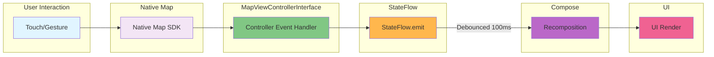

---

## Provider Switching Flow

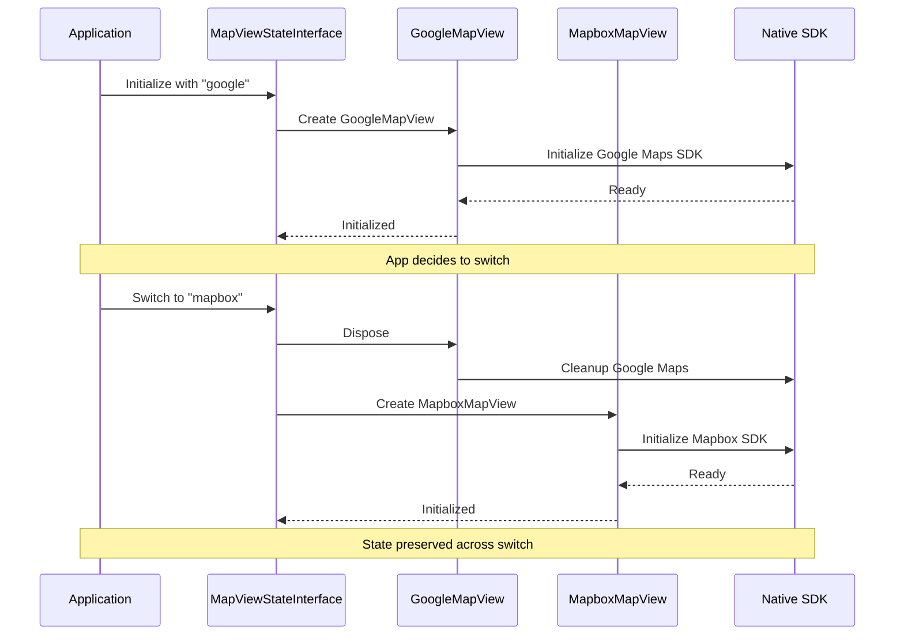

---

## Usage Example

### Basic Map Setup

```kotlin
import com.mapconductor.googlemaps.GoogleMapView
import com.mapconductor.core.features.GeoPointInterface

@Composable
fun MyMapScreen() {
    GoogleMapView(
        modifier = Modifier.fillMaxSize(),
        cameraPosition = MapCameraPositionInterface(
            center = GeoPointInterface(35.6812, 139.7671), // Tokyo
            zoom = 12.0
        )
    ) {
        // Add markers
        Marker(
            position = GeoPointInterface(35.6812, 139.7671),
            title = "Tokyo Tower"
        )

        // Add circles
        Circle(
            center = GeoPointInterface(35.6812, 139.7671),
            radius = 1000.0, // meters
            fillColor = Color.Blue.copy(alpha = 0.3f),
            strokeColor = Color.Blue
        )

        // Add polylines
        Polyline(
            points = listOf(
                GeoPointInterface(35.6812, 139.7671),
                GeoPointInterface(35.6895, 139.6917)
            ),
            color = Color.Red,
            width = 5.0f
        )
    }
}
```

### Switching Providers

```kotlin
// Just change the import and component name
import com.mapconductor.mapbox.MapboxMapView

@Composable
fun MyMapScreen() {
    MapboxMapView( // Changed from GoogleMapView
        // ... same code, works identically
    )
}
```

---

## Architecture Benefits

### 1. Provider Independence
Write once, switch providers by changing imports. No code changes required.

### 2. Type Safety
Kotlin generics ensure compile-time type checking across all providers.

### 3. Performance Optimization
Spatial indexing (HexGeocellInterface + KDTree) provides O(log n) marker queries.

### 4. Modern Android Development
- Jetpack Compose for declarative UI
- StateFlow for reactive updates
- Kotlin coroutines for async operations

### 5. Extensibility
Easy to add new providers by implementing:
- `MapViewControllerInterface`
- Overlay controllers
- Overlay renderers

### 6. Maintainability
Clear separation of concerns:
- Core abstractions stable
- Provider implementations isolated
- Changes don't ripple across layers

### 7. Testing
- Unit test core logic without map SDK
- Mock providers for integration tests
- UI tests with Espresso

---

## Build & Distribution

### Build Configuration

```kotlin
// build.gradle.kts
android {
    compileSdk = 35
    defaultConfig {
        minSdk = 26
        targetSdk = 35
    }

    compileOptions {
        sourceCompatibility = JavaVersion.VERSION_17
        targetCompatibility = JavaVersion.VERSION_17
    }

    kotlinOptions {
        jvmTarget = "17"
    }

    buildFeatures {
        compose = true
    }
}
```

### Publishing Targets

1. **Maven Central** (Primary)
   - Nexus Maven Central Portal (NMCP)
   - Public releases

2. **GitHub Packages** (Secondary)
   - Development builds
   - Pre-release versions

### Module Dependencies

```kotlin
dependencies {
    // Core module
    implementation("com.mapconductor:mapconductor-core:$version")

    // Choose provider
    implementation("com.mapconductor:mapconductor-for-googlemaps:$version")
    // OR
    implementation("com.mapconductor:mapconductor-for-mapbox:$version")

    // Optional: Icons
    implementation("com.mapconductor:mapconductor-icons:$version")

    // OR use BOM for version management
    implementation(platform("com.mapconductor:mapconductor-bom:$version"))
    implementation("com.mapconductor:mapconductor-core")
    implementation("com.mapconductor:mapconductor-for-googlemaps")
}
```

---

## Summary

**MapConductor** is a sophisticated Android SDK that uses **layered architecture** with **generic type system** to provide a unified API for multiple map providers. Its modern tech stack (Kotlin, Jetpack Compose, StateFlow) and performance optimizations (spatial indexing, lazy initialization, debounced updates) make it production-ready for enterprise Android applications.

The architecture elegantly separates:
- **Core abstractions** - Stable, provider-independent API
- **Provider implementations** - Isolated, swappable backends
- **Application layer** - Clean, declarative usage

This design ensures type safety, maintainability, extensibility, and freedom from vendor lock-in while leveraging modern Android development best practices.
