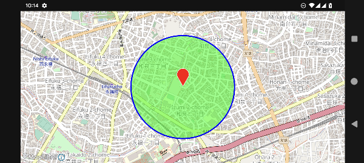

# MapConductor Android SDK

- [English Doc](./README.md)
- [Japanese Doc](./README.ja.md)

**Una sola API de mapas para Android que funciona con múltiples proveedores de mapas.**

MapConductor Android SDK es una librería de mapas de código abierto para Android que te permite trabajar con múltiples SDKs de mapas a través de una API única y consistente basada en Jetpack Compose.

En lugar de escribir código de mapas distinto para Google Maps, Mapbox, HERE Maps, ArcGIS y MapLibre, MapConductor ofrece abstracciones compartidas para mapas, estado de cámara, marcadores, formas, superposiciones y funciones avanzadas de mapas.

Escribe tu interfaz de mapa una sola vez.
Elige el proveedor de mapas que mejor se adapte a tu producto.

---

## ¿Por qué MapConductor?

El desarrollo de mapas para móviles suele quedar fuertemente acoplado a un SDK de mapas específico. Cada proveedor tiene su propio diseño de API, modelo de ciclo de vida, comportamiento de renderizado y conjunto de funciones. Esto dificulta cambiar de proveedor, dar soporte a varios backends de mapas o mantener limpio el código relacionado con mapas en una aplicación moderna con Compose.

MapConductor resuelve esto proporcionando una capa común sobre los principales SDKs de mapas para Android.

Con MapConductor puedes:

* Usar una API orientada a Jetpack Compose para la interfaz de mapas
* Cambiar entre los proveedores de mapas compatibles con menos trabajo de reescritura
* Compartir la misma lógica de marcadores, círculos, polilíneas, polígonos y superposiciones
* Construir funciones de mapas independientes del proveedor, como mapas de calor y agrupamiento de marcadores
* Mantener tu código de aplicación enfocado en el comportamiento del mapa, no en las diferencias específicas de cada SDK


---

## Proveedores de mapas compatibles

MapConductor actualmente es compatible con los siguientes proveedores de mapas para Android:

| Proveedor        | Módulo                            |
| ---------------- | --------------------------------- |
| Google Maps      | `com.mapconductor:for-googlemaps` |
| Mapbox           | `com.mapconductor:for-mapbox`     |
| HERE Maps        | `com.mapconductor:for-here`       |
| ArcGIS Maps SDK  | `com.mapconductor:for-arcgis`     |
| MapLibre         | `com.mapconductor:for-maplibre`   |

Puedes elegir un proveedor para tu app, o estructurar tu código de modo que el proveedor pueda cambiarse más adelante.

---

## Funciones principales

MapConductor ofrece una API unificada para las funciones comunes de interfaz de mapas y geoespaciales:

* Componentes de vista de mapa para múltiples proveedores
* Estado de cámara y posición de cámara
* Marcadores
* Iconos de marcador personalizados
* Burbujas de información escritas con Jetpack Compose
* Círculos con radio en metros
* Polilíneas
* Polígonos
* Imágenes de superficie (ground images)
* Capas de teselas ráster (raster tile layers)
* Mapas de calor
* Agrupamiento de marcadores
* Capas GeoJSON
* Tipos de geometría compartidos como `GeoPoint`
* Gestión de estado reactiva para objetos de mapa

El objetivo no es solo envolver el SDK de cada proveedor, sino también ofrecer un comportamiento consistente, en la medida de lo posible, entre los distintos motores de mapas.

---

## Instalación

Agrega los repositorios de Maven Central y Google a tu proyecto de Android si aún no están configurados.

```kotlin
dependencyResolutionManagement {
    repositoriesMode.set(RepositoriesMode.FAIL_ON_PROJECT_REPOS)
    repositories {
        google()
        mavenCentral()
    }
}
```

Luego agrega las dependencias de MapConductor.

```kotlin
dependencies {
    implementation(platform("com.mapconductor:mapconductor-bom:<latest-version>"))

    implementation("com.mapconductor:core")

    // Elige uno o más módulos de proveedor de mapas
    implementation("com.mapconductor:for-googlemaps")
    // implementation("com.mapconductor:for-mapbox")
    // implementation("com.mapconductor:for-here")
    // implementation("com.mapconductor:for-arcgis")
    // implementation("com.mapconductor:for-maplibre")

    // Módulos de funciones opcionales
    implementation("com.mapconductor:icons")
    implementation("com.mapconductor:heatmap")
    implementation("com.mapconductor:marker-clustering")
    implementation("com.mapconductor:geojson-layer")
}
```

Cada proveedor de mapas puede requerir su propia clave de API, token de acceso, configuración de Gradle o configuración en el manifiesto de Android.

Por favor revisa la guía de configuración del proveedor que estés usando.
- [Configuración de Google Maps Android API](https://docs-android.mapconductor.com/setup/google-maps/)
- [Configuración de MapBox](https://docs-android.mapconductor.com/setup/mapbox/)
- [Configuración de HERE](https://docs-android.mapconductor.com/setup/here-maps/)
- [Configuración de ArcGIS](https://docs-android.mapconductor.com/setup/arcgis/)
- [Configuración de MapLibre](https://docs-android.mapconductor.com/setup/maplibre/)

---

## Ejemplo básico

El siguiente ejemplo muestra un mapa simple con Compose que incluye un marcador y un círculo.

```kotlin
@Composable
fun SimpleMapScreen(modifier: Modifier) {
    val mapState = rememberMapLibreMapViewState(
        cameraPosition = MapCameraPosition(
            position = GeoPoint(35.6762, 139.6503),
            zoom = 15.0,
        ),
        mapDesign = MapLibreDesign.OpenMapTiles,
    )

    MapLibreMapView(
        modifier = modifier,
        state = mapState,
    ) {
        Marker(
            state = MarkerState(
                position = GeoPoint(35.6762, 139.6503),
            )
        )

        Circle(
            state = CircleState(
                center = GeoPoint(35.6762, 139.6503),
                radiusMeters = 500.0,
                fillColor = Color.Green.copy(alpha = 0.5f),
                strokeColor = Color.Blue,
                strokeWidth = 3.dp,
            )
        )
    }
}
```

Este ejemplo usa MapLibre Maps, pero los objetos del mapa están escritos usando conceptos de MapConductor. La misma lógica de superposiciones se puede adaptar a otros proveedores compatibles.



---

## Cambiar de proveedor de mapas

Una de las ideas principales detrás de MapConductor es que tus superposiciones de mapa no deberían tener que reescribirse cuando cambias de proveedor de mapas.

Por ejemplo:

- MapLibre

  ```kotlin
  val initCameraPosition = MapCameraPosition(...)

  val mapLibreMapState = rememberMapLibreMapViewState(
      cameraPosition = initCameraPosition,
      mapDesign = mapDesign = MapLibreDesign.OpenMapTiles,
  )

  MapLibreMapView(state = mapLibreMapState) {
      MapContent()
  }
  ```

- <details>
  <summary>Google Maps (Toca para abrir)</summary>

  ```kotlin
  val initCameraPosition = MapCameraPosition(...)

  val googleMapState = rememberGoogleMapViewState(
      cameraPosition = initCameraPosition,
      mapDesign = GoogleMapDesign.Normal,
  )

  GoogleMapView(state = googleMapState) {
      MapContent()
  }
  ```
</details>

- <details>
  <summary>Mapbox (Toca para abrir)</summary>

  ```kotlin
  val initCameraPosition = MapCameraPosition(...)

  val mapboxMapState = rememberMapboxMapViewState(
      cameraPosition = initCameraPosition,
      mapDesign = MapboxMapDesign.Standard,
  )

  MapboxMapView(state = mapboxMapState) {
      MapContent()
  }
  ```
</details>

- <details>
  <summary>HERE (Toca para abrir)</summary>

  ```kotlin
  val initCameraPosition = MapCameraPosition(...)

  val hereMapState = rememberHereMapViewState(
      cameraPosition = initCameraPosition,
      mapDesign = HereMapDesign.NormalDay,
  )

  HereMapView(state = hereMapState) {
      MapContent()
  }
  ```
</details>

- <details>
  <summary>ArcGIS 2D (Toca para abrir)</summary>

  ```kotlin
  val initCameraPosition = MapCameraPosition(...)

  val arcgisMapState = rememberArcGISMapViewState(
      cameraPosition = initCameraPosition,
      mapDesign = ArcGISDesign.Streets,
  )

  ArcGISMapView2D(state = arcgisMapState) {
      MapContent()
  }
  ```
</details>

- <details>
  <summary>ArcGIS 3D (Toca para abrir)</summary>

  ```kotlin
  val initCameraPosition = MapCameraPosition(...)

  val arcgisMapState = rememberArcGISMapViewState(
      cameraPosition = initCameraPosition,
      mapDesign = ArcGISDesign.Streets,
  )

  ArcGISMapView(state = arcgisMapState) {
      MapContent()
  }
  ```
</details>

Tu contenido de mapa reutilizable puede incluir marcadores, círculos, polilíneas, polígonos, mapas de calor, agrupaciones u otros componentes de MapConductor.

```kotlin
@Composable
fun MapContent() {
    Marker(
        state = rememberMarkerState(
            position = GeoPoint(35.6762, 139.6503),
        )
    )

    Polyline(
        state = rememberPolylineState(
            points = listOf(
                GeoPoint(35.6762, 139.6503),
                GeoPoint(35.6895, 139.6917),
            )
        )
    )
}
```

Aún se requiere una configuración específica por proveedor, pero la interfaz de mapas a nivel de aplicación puede ser mucho más portable.

---

## Resumen de módulos

| Módulo            | Artefacto                            | Descripción                                                          |
| ----------------- | ------------------------------------ | --------------------------------------------------------------------- |
| BOM               | `com.mapconductor:mapconductor-bom`  | Alinea las versiones de los módulos de MapConductor                   |
| Core              | `com.mapconductor:core`              | Abstracciones principales, tipos de geometría, estado de cámara y de superposiciones |
| Google Maps       | `com.mapconductor:for-googlemaps`    | Implementación del proveedor Google Maps                              |
| Mapbox            | `com.mapconductor:for-mapbox`        | Implementación del proveedor Mapbox                                   |
| HERE Maps         | `com.mapconductor:for-here`          | Implementación del proveedor HERE Maps                                |
| ArcGIS            | `com.mapconductor:for-arcgis`        | Implementación del proveedor ArcGIS                                   |
| MapLibre          | `com.mapconductor:for-maplibre`      | Implementación del proveedor MapLibre                                 |
| Icons             | `com.mapconductor:icons`             | Iconos de marcador basados en Compose y utilidades de burbujas de información |
| Heatmap           | `com.mapconductor:heatmap`           | Superposición de mapa de calor independiente del proveedor            |
| Marker Clustering | `com.mapconductor:marker-clustering` | Soporte de agrupamiento de marcadores                                 |
| GeoJSON Layer     | `com.mapconductor:geojson-layer`     | Soporte de capas GeoJSON                                              |

---

## Estado de las funciones

| Función           | Google Maps |  Mapbox | HERE Maps |  ArcGIS | MapLibre |
| ------------------ | ----------: | ------: | --------: | ------: | -------: |
| Map               |           ✅ |       ✅ |         ✅ |       ✅ |        ✅ |
| Marker            |           ✅ |       ✅ |         ✅ |       ✅ |        ✅ |
| Circle            |           ✅ |       ✅ |         ✅ |       ✅ |        ✅ |
| Polyline          |           ✅ |       ✅ |         ✅ |       ✅ |        ✅ |
| Polygon           |           ✅ |       ✅ |         ✅ |       ✅ |        ✅ |
| Ground Image      |           ✅ |       ✅ |         ✅ |       ✅ |        ✅ |
| Heatmap           |           ✅ |       ✅ |         ✅ |       ✅ |        ✅ |
| Marker Clustering |           ✅ |       ✅ |         ✅ |       ✅ |        ✅ |
| Raster Tile Layer |           ✅ |       ✅ |         ✅ |       ✅ |        ✅ |
| Vector Tile Layer |     Planned | Planned |   Planned | Planned |  Planned |

MapConductor está en desarrollo activo. Consulta la documentación y las notas de la versión para conocer el comportamiento y las limitaciones más recientes de cada proveedor.

---

## ¿Para quién es esto?

MapConductor te resulta útil si estás:

* Construyendo una app de Android con Jetpack Compose y mapas
* Evaluando múltiples proveedores de mapas
* Planeando una posible migración de un SDK de mapas a otro
* Manteniendo funciones de mapas para distintos requisitos de clientes o regiones
* Construyendo componentes de interfaz de mapas reutilizables
* Buscando una capa de abstracción de código abierto para mapas móviles

Es especialmente útil cuando quieres que tu código de aplicación describa qué debe aparecer en el mapa, en lugar de cómo espera cada SDK de proveedor que se implemente esa función.

---

## Documentación

La documentación está disponible en:

https://docs-android.mapconductor.com/es-419/

La documentación incluye:

* Guías de introducción
* Configuración específica por proveedor
* Componentes de vista de mapa
* Gestión de estado
* Manejo de eventos
* Clases principales de geometría
* Iconos de marcador
* Mapas de calor
* Agrupamiento de marcadores
* Capas GeoJSON

---

## Estado del proyecto

MapConductor Android SDK ya está publicado y se encuentra en desarrollo activo.

El proyecto busca hacer que el desarrollo de mapas sea más flexible, portable y amigable con Compose en los principales proveedores de mapas para Android. Algunas funciones avanzadas pueden seguir siendo experimentales o presentar diferencias específicas por proveedor.

Los comentarios, reportes de errores y contribuciones son bienvenidos.

---

## Licencia

MapConductor Android SDK se publica bajo la Licencia Apache 2.0.
