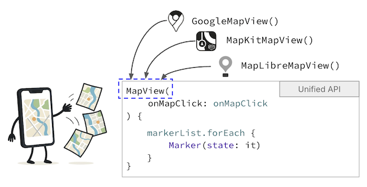

# MapConductor Android SDK

- [English Doc](./README.ja.md)
- [Spanish Doc](./README.es-419.md)

**複数のマッププロバイダーに対応する、ひとつのAndroidマップAPI。**

MapConductor Android SDKは、Jetpack Composeベースの単一で一貫したAPIを通じて複数のマップSDKを扱えるようにする、オープンソースのAndroid向けマッピングライブラリです。

Google Maps、Mapbox、HERE Maps、ArcGIS、MapLibreごとに異なるマップコードを書く代わりに、MapConductorはマップ、カメラの状態、マーカー、図形、オーバーレイ、高度なマップ機能のための共通の抽象化を提供します。

マップUIは一度だけ書きます。
プロダクトに合ったマッププロバイダーを選びましょう。

---

## なぜMapConductorなのか?

モバイルのマップ開発は、特定のマップSDKに強く依存してしまうことがよくあります。各プロバイダーは独自のAPI設計、ライフサイクルモデル、レンダリングの挙動、機能セットを持っています。これにより、プロバイダーの切り替えや複数のマップバックエンドのサポート、最新のCompose アプリケーションにおけるマップ関連コードのクリーンな維持が難しくなります。

MapConductorは、主要なAndroidマップSDKの上に共通レイヤーを提供することでこれを解決します。

MapConductorを使うと、以下のことができます:

* マップUIにComposeファーストのAPIを使う
* 少ない書き換え作業でサポートされているマッププロバイダーを切り替える
* マーカー、円、ポリライン、ポリゴン、オーバーレイのロジックを共有する
* プロバイダーに依存しないヒートマップやマーカークラスタリングなどのマップ機能を構築する
* アプリケーションコードをSDK固有の差異ではなくマップの挙動に集中させる


---

## サポートされているマッププロバイダー

MapConductorは現在、以下のAndroidマッププロバイダーをサポートしています:

| プロバイダー      | モジュール                          |
| ----------------- | --------------------------------- |
| Google Maps     | `com.mapconductor:for-googlemaps` |
| Mapbox          | `com.mapconductor:for-mapbox`     |
| HERE Maps       | `com.mapconductor:for-here`       |
| ArcGIS Maps SDK | `com.mapconductor:for-arcgis`     |
| MapLibre        | `com.mapconductor:for-maplibre`   |

アプリ用に1つのプロバイダーを選んでもよいですし、後でプロバイダーを変更できるようにコードを構成することもできます。

---

## コア機能

MapConductorは、一般的なマップUIおよび地理空間機能に対して統一されたAPIを提供します:

* 複数プロバイダー向けのマップビューコンポーネント
* カメラの状態とカメラ位置
* マーカー
* カスタムマーカーアイコン
* Jetpack Composeで書かれた情報バブル
* メートル単位の半径を持つ円
* ポリライン
* ポリゴン
* グラウンドイメージ
* ラスタータイルレイヤー
* ヒートマップ
* マーカークラスタリング
* GeoJSONレイヤー
* `GeoPoint`などの共有ジオメトリ型
* マップオブジェクトのためのリアクティブな状態管理

目的は各プロバイダーSDKをラップするだけでなく、可能な限り異なるマップエンジン間で一貫した動作を提供することです。

---

## インストール

まだ設定していない場合は、AndroidプロジェクトにMaven CentralとGoogleのリポジトリを追加してください。

```kotlin
dependencyResolutionManagement {
    repositoriesMode.set(RepositoriesMode.FAIL_ON_PROJECT_REPOS)
    repositories {
        google()
        mavenCentral()
    }
}
```

次にMapConductorの依存関係を追加します。

```kotlin
dependencies {
    implementation(platform("com.mapconductor:mapconductor-bom:<latest-version>"))

    implementation("com.mapconductor:core")

    // 1つ以上のマッププロバイダーモジュールを選択
    implementation("com.mapconductor:for-googlemaps")
    // implementation("com.mapconductor:for-mapbox")
    // implementation("com.mapconductor:for-here")
    // implementation("com.mapconductor:for-arcgis")
    // implementation("com.mapconductor:for-maplibre")

    // オプションの機能モジュール
    implementation("com.mapconductor:icons")
    implementation("com.mapconductor:heatmap")
    implementation("com.mapconductor:marker-clustering")
    implementation("com.mapconductor:geojson-layer")
}
```

各マッププロバイダーは、それぞれ独自のAPIキー、アクセストークン、Gradleの設定、またはAndroidマニフェストの設定が必要な場合があります。

使用するプロバイダーのセットアップガイドを確認してください。
- [Google Maps Android APIのセットアップ](https://mapconductor.com/setup/android/google-maps/)
- [MapBoxのセットアップ](https://mapconductor.com/setup/android/mapbox/)
- [HEREのセットアップ](https://mapconductor.com/setup/android/here/)
- [ArcGISのセットアップ](https://mapconductor.com/setup/android/arcgis/)
- [MapLibreのセットアップ](https://mapconductor.com/setup/android/maplibre/)

---

## 基本的な例

以下の例は、マーカーと円を含むシンプルなComposeマップを示しています。

```kotlin
@Composable
fun SimpleMapScreen(modifier: Modifier) {
    val mapState = rememberMapLibreMapViewState(
        cameraPosition = MapCameraPosition(
            position = GeoPoint(35.6762, 139.6503),
            zoom = 15.0,
        ),
        mapDesign = MapLibreDesign.OpenMapTiles,
    )

    MapLibreMapView(
        modifier = modifier,
        state = mapState,
    ) {
        Marker(
            state = MarkerState(
                position = GeoPoint(35.6762, 139.6503),
            )
        )

        Circle(
            state = CircleState(
                center = GeoPoint(35.6762, 139.6503),
                radiusMeters = 500.0,
                fillColor = Color.Green.copy(alpha = 0.5f),
                strokeColor = Color.Blue,
                strokeWidth = 3.dp,
            )
        )
    }
}
```

この例ではMapLibre Mapsを使用していますが、マップオブジェクトはMapConductorの概念を使って書かれています。同じオーバーレイのロジックを他のサポートされているプロバイダーに適用できます。


---

## マッププロバイダーの切り替え



MapConductorの主な考え方の1つは、マッププロバイダーを変更してもマップオーバーレイを書き直す必要がないということです。

例:

- MapLibre

  ```kotlin
  val initCameraPosition = MapCameraPosition(...)

  val mapLibreMapState = rememberMapLibreMapViewState(
      cameraPosition = initCameraPosition,
      mapDesign = mapDesign = MapLibreDesign.OpenMapTiles,
  )

  MapLibreMapView(state = mapLibreMapState) {
      MapContent()
  }
  ```

- <details>
  <summary>Google Maps (タップして開く)</summary>

  ```kotlin
  val initCameraPosition = MapCameraPosition(...)

  val googleMapState = rememberGoogleMapViewState(
      cameraPosition = initCameraPosition,
      mapDesign = GoogleMapDesign.Normal,
  )

  GoogleMapView(state = googleMapState) {
      MapContent()
  }
  ```
</details>

- <details>
  <summary>Mapbox (タップして開く)</summary>

  ```kotlin
  val initCameraPosition = MapCameraPosition(...)

  val mapboxMapState = rememberMapboxMapViewState(
      cameraPosition = initCameraPosition,
      mapDesign = MapboxMapDesign.Standard,
  )

  MapboxMapView(state = mapboxMapState) {
      MapContent()
  }
  ```
</details>

- <details>
  <summary>HERE (タップして開く)</summary>

  ```kotlin
  val initCameraPosition = MapCameraPosition(...)

  val hereMapState = rememberHereMapViewState(
      cameraPosition = initCameraPosition,
      mapDesign = HereMapDesign.NormalDay,
  )

  HereMapView(state = hereMapState) {
      MapContent()
  }
  ```
</details>

- <details>
  <summary>ArcGIS 2D (タップして開く)</summary>

  ```kotlin
  val initCameraPosition = MapCameraPosition(...)

  val arcgisMapState = rememberArcGISMapViewState(
      cameraPosition = initCameraPosition,
      mapDesign = ArcGISDesign.Streets,
  )

  ArcGISMapView2D(state = arcgisMapState) {
      MapContent()
  }
  ```
</details>

- <details>
  <summary>ArcGIS 3D (タップして開く)</summary>

  ```kotlin
  val initCameraPosition = MapCameraPosition(...)

  val arcgisMapState = rememberArcGISMapViewState(
      cameraPosition = initCameraPosition,
      mapDesign = ArcGISDesign.Streets,
  )

  ArcGISMapView(state = arcgisMapState) {
      MapContent()
  }
  ```
</details>

再利用可能なマップコンテンツには、マーカー、円、ポリライン、ポリゴン、ヒートマップ、クラスター、その他のMapConductorコンポーネントを含めることができます。

```kotlin
@Composable
fun MapContent() {
    Marker(
        state = rememberMarkerState(
            position = GeoPoint(35.6762, 139.6503),
        )
    )

    Polyline(
        state = rememberPolylineState(
            points = listOf(
                GeoPoint(35.6762, 139.6503),
                GeoPoint(35.6895, 139.6917),
            )
        )
    )
}
```

プロバイダー固有のセットアップは依然として必要ですが、アプリケーションレベルのマップUIはより高いポータビリティを維持できます。

---

## モジュール概要

| モジュール          | アーティファクト                       | 説明                                                         |
| ----------------- | ------------------------------------ | ------------------------------------------------------------------- |
| BOM               | `com.mapconductor:mapconductor-bom`  | MapConductorモジュールのバージョンを揃える                                 |
| Core              | `com.mapconductor:core`              | コアの抽象化、ジオメトリ型、カメラの状態、オーバーレイの状態 |
| Google Maps       | `com.mapconductor:for-googlemaps`    | Google Mapsプロバイダー実装                                 |
| Mapbox            | `com.mapconductor:for-mapbox`        | Mapboxプロバイダー実装                                      |
| HERE Maps         | `com.mapconductor:for-here`          | HERE Mapsプロバイダー実装                                   |
| ArcGIS            | `com.mapconductor:for-arcgis`        | ArcGISプロバイダー実装                                      |
| MapLibre          | `com.mapconductor:for-maplibre`      | MapLibreプロバイダー実装                                    |
| Icons             | `com.mapconductor:icons`             | Composeベースのマーカーアイコンと情報バブルのユーティリティ                |
| Heatmap           | `com.mapconductor:heatmap`           | プロバイダーに依存しないヒートマップオーバーレイ                            |
| Marker Clustering | `com.mapconductor:marker-clustering` | マーカークラスタリングのサポート                                              |
| GeoJSON Layer     | `com.mapconductor:geojson-layer`     | GeoJSONレイヤーのサポート                                                |

---

## 機能対応状況

| 機能               | Google Maps |  Mapbox | HERE Maps |  ArcGIS | MapLibre |
| ----------------- | ----------: | ------: | --------: | ------: | -------: |
| Map               |           ✅ |       ✅ |         ✅ |       ✅ |        ✅ |
| Marker            |           ✅ |       ✅ |         ✅ |       ✅ |        ✅ |
| Circle            |           ✅ |       ✅ |         ✅ |       ✅ |        ✅ |
| Polyline          |           ✅ |       ✅ |         ✅ |       ✅ |        ✅ |
| Polygon           |           ✅ |       ✅ |         ✅ |       ✅ |        ✅ |
| Ground Image      |           ✅ |       ✅ |         ✅ |       ✅ |        ✅ |
| Heatmap           |           ✅ |       ✅ |         ✅ |       ✅ |        ✅ |
| Marker Clustering |           ✅ |       ✅ |         ✅ |       ✅ |        ✅ |
| Raster Tile Layer |           ✅ |       ✅ |         ✅ |       ✅ |        ✅ |
| Vector Tile Layer |     Planned | Planned |   Planned | Planned |  Planned |

MapConductorは活発に開発が進められています。最新のプロバイダー固有の挙動や制限事項については、ドキュメントとリリースノートを確認してください。

---

## こんな方に向いています

MapConductorは、以下のような方に役立ちます:

* Jetpack Composeとマップを使ったAndroidアプリを構築している
* 複数のマッププロバイダーを評価している
* あるマップSDKから別のものへの移行を計画している
* 異なる顧客や地域の要件にわたってマップ機能を保守している
* 再利用可能なマップUIコンポーネントを構築している
* モバイルマップ向けのオープンソースの抽象化レイヤーを探している

各プロバイダーSDKがその機能をどのように実装することを期待しているかではなく、マップに何を表示すべきかをアプリケーションコードで記述したい場合に特に役立ちます。

---

## ドキュメント

ドキュメントは以下で利用できます:

https://mapconductor.com/ja/

ドキュメントには以下が含まれます:

* スタートガイド
* プロバイダー固有のセットアップ
* マップビューコンポーネント
* 状態管理
* イベントハンドリング
* コアジオメトリクラス
* マーカーアイコン
* ヒートマップ
* マーカークラスタリング
* GeoJSONレイヤー

---

## プロジェクトの状況

MapConductor Android SDKはリリース済みで、活発に開発が進められています。

このプロジェクトは、主要なAndroidマッププロバイダーにわたって、マップ開発をより柔軟でポータブル、かつComposeフレンドリーにすることを目指しています。一部の高度な機能は実験的であったり、プロバイダー固有の差異がある場合があります。

フィードバック、Issue、コントリビューションを歓迎します。

---

## ライセンス

MapConductor Android SDKはApache License 2.0のもとでリリースされています。
