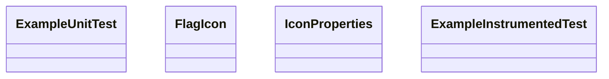

# Class Diagrams

## mapconductor-core

```mermaid
classDiagram
    class ExampleUnitTest
    class Settings
    class IconResource
    class MapViewScope
    class MarkerOverlay
    class CircleOverlay
    class PolylineOverlay
    class InitProvider
    class StateFlowDelegate
    class BaseMapViewSaver
    class MapDesignType
    class MapViewHolder
    class MapPaddings
    class MapPaddingsImpl
    class StaticHolder
    class MapViewHolderStoreBaseAsync
    class MapViewState
    class MoveCameraCallback
    class MapViewStateImpl
    class MapOverlay
    class MapOverlayRegistry
    class IMapCameraPosition
    class MapCameraPosition
    class MarkerOverlayManager
    class MarkerOverlayManagerImpl
    class MarkerIcon
    class AbstractMarkerIcon
    class AndroidDrawableIcon
    class DefaultIcon
    class IconProperties
    class AdaptiveScaleInfo
    class MarkerEntity
    class MarkerEntityImpl
    class MarkerRendererFactory
    class MarkerRenderer
    class UpdateParams
    class AbstractMarkerRenderer
    class MarkerManager
    class MarkerState
    class MarkerFingerPrint
    class BitmapIcon
    class PolylineRendererFactory
    class PolylineRenderer
    class UpdateParams
    class AbstractPolylineRenderer
    class PolylineEntity
    class PolylineEntityImpl
    class PolylineOverlayManager
    class PolylineOverlayManagerImpl
    class PolylineState
    class PolylineFingerPrint
    class InfoBubbleState
    class InfoBubbleEntry
    class KDTree
    class Node
    class KDTreeStats
    class HexCellRegistry
    class RegistryStats
    class HexCoord
    class HexCell
    class HexCellWithDistance
    class HexGeocell
    class IdentifiedHexCell
    class StateOrValue
    class Static
    class Dynamic
    class MapViewController
    class SearchRangeAnalysis
    class BaseMapViewController
    class CircleEntity
    class CircleEntityImpl
    class CircleManager
    class CircleState
    class CircleFingerPrint
    class Projection
    class GeoRectBounds
    class IGeoPoint
    class GeoPoint
    class ExampleInstrumentedTest
    class ContentProvider()
    ContentProvider() <|-- InitProvider
    MarkerIcon <|-- AbstractMarkerIcon
```

## mapconductor-for-googlemaps

```mermaid
classDiagram
    class ExampleUnitTest
    class GoogleMapDesign
    class IGoogleMapViewController
    class GoogleMapViewController
    class GoogleMapViewScope
    class GoogleMapViewHolderImpl
    class IGoogleMapViewState
    class GoogleMapViewState
    class GoogleMapViewSaver
    class DefaultGoogleMapMarkerRenderer
    class GoogleMapMarkerRenderer
    class DefaultGoogleMapPolylineRenderer
    class GoogleMapPolylineRenderer
    class ExampleInstrumentedTest
    class MapViewController
    MapViewController <|-- IGoogleMapViewController
    class MapViewScope()
    MapViewScope() <|-- GoogleMapViewScope
    class MapViewState
    MapViewState <|-- IGoogleMapViewState
    class BaseMapViewSaver
    BaseMapViewSaver <|-- GoogleMapViewSaver
    class MarkerRendererFactory
    MarkerRendererFactory <|-- DefaultGoogleMapMarkerRenderer
    class PolylineRendererFactory
    PolylineRendererFactory <|-- DefaultGoogleMapPolylineRenderer
```

## mapconductor-for-mapbox

```mermaid
classDiagram
    class ExampleUnitTest
    class MapboxMapDesign
    class Custom
    class MapboxMapViewHolderImpl
    class IMapboxMapViewController
    class MapboxMapViewController
    class MapboxMapViewScope
    class IMapboxMapViewState
    class MapboxMapViewState
    class MapboxMapViewSaver
    class IMapboxPaddings
    class MapboxPaddings
    class MarkerLayer
    class DefaultMapboxMarkerRenderer
    class MapboxMarkerRenderer
    class MarkerDragLayer
    class MapboxPolylineLayer
    class DefaultMapboxPolylineRenderer
    class MapboxPolylineRenderer
    class MapboxCircleLayer
    class ExampleInstrumentedTest
    class MapViewController
    MapViewController <|-- IMapboxMapViewController
    class MapViewScope()
    MapViewScope() <|-- MapboxMapViewScope
    class MapViewState
    MapViewState <|-- IMapboxMapViewState
    class BaseMapViewSaver
    BaseMapViewSaver <|-- MapboxMapViewSaver
    class MapPaddings
    MapPaddings <|-- IMapboxPaddings
    class MarkerRendererFactory
    MarkerRendererFactory <|-- DefaultMapboxMarkerRenderer
    class PolylineRendererFactory
    PolylineRendererFactory <|-- DefaultMapboxPolylineRenderer
```

## mapconductor-for-here

```mermaid
classDiagram
    class ExampleUnitTest
    class HereMapViewScope
    class HereMapViewHolderImpl
    class HereMapDesign
    class IHereMapViewController
    class HereMapViewController
    class HereMapViewInitOptions
    class IHereMapViewState
    class HereMapViewState
    class HereMapViewSaver
    class DefaultHereMapMarkerRenderer
    class HereMapMarkerRenderer
    class DefaultHereMapPolylineRenderer
    class HereMapPolylineRenderer
    class ExampleInstrumentedTest
    class MapViewScope()
    MapViewScope() <|-- HereMapViewScope
    class MapViewController
    MapViewController <|-- IHereMapViewController
    class MapViewState
    MapViewState <|-- IHereMapViewState
    class BaseMapViewSaver
    BaseMapViewSaver <|-- HereMapViewSaver
    class MarkerRendererFactory
    MarkerRendererFactory <|-- DefaultHereMapMarkerRenderer
    class PolylineRendererFactory
    PolylineRendererFactory <|-- DefaultHereMapPolylineRenderer
```

## mapconductor-for-arcgis

```mermaid
classDiagram
    class ExampleUnitTest
    class ArcGISMapViewInitOptions
    class IArcGISMapViewState
    class ArcGISMapViewState
    class ArcGISMapViewSaver
    class ZoomAltitudeConverter
    class ArcGISDesignType
    class ArcGISDesign
    class IArcGISMapViewController
    class SelectedMarker
    class ArcGISMapViewController
    class WrapSceneView
    class ArcGISMapViewHolderImpl
    class ArcGISMapViewScope
    class DefaultArcGISMarkerRender
    class ArcGISMarkerRenderer
    class DefaultArcGISPolylineRenderer
    class ArcGISPolylineRenderer
    class ExampleInstrumentedTest
    class MapViewState
    MapViewState <|-- IArcGISMapViewState
    class BaseMapViewSaver
    BaseMapViewSaver <|-- ArcGISMapViewSaver
    class MapDesignType
    MapDesignType <|-- ArcGISDesignType
    class MapViewController
    MapViewController <|-- IArcGISMapViewController
    class FrameLayout
    FrameLayout <|-- WrapSceneView
    class MapViewScope()
    MapViewScope() <|-- ArcGISMapViewScope
    class MarkerRendererFactory
    MarkerRendererFactory <|-- DefaultArcGISMarkerRender
    class PolylineRendererFactory
    PolylineRendererFactory <|-- DefaultArcGISPolylineRenderer
```

## mapconductor-icons



## example-app

```mermaid
classDiagram
    class ExampleUnitTest
    class StarCircleView
    class AppViewModel
    class AppViewModelImpl
    class MainActivity
    class ToastMessage
    class IconItem
    class ExampleInstrumentedTest
    class ComponentActivity()
    ComponentActivity() <|-- MainActivity
```
